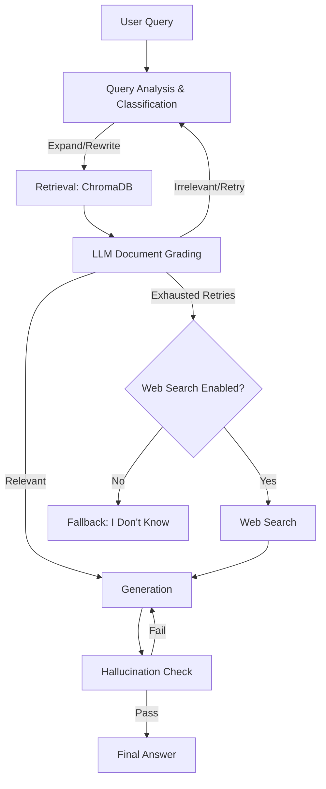

# TechDocSystem - Advanced Agentic RAG Assistant

A self-corrective Retrieval-Augmented Generation (RAG) system built with **LangGraph**, **FastAPI**, and **Streamlit**. Designed specifically for answering complex questions about technical documentation, codebases, and APIs with strict factual grounding.

---

## 🌟 Core Features 

- **Agentic Orchestration**: Uses LangGraph to orchestrate a multi-step reasoning pipeline (Query Analysis → Retrieval → LLM Grading → Generation → Hallucination Verification).
- **Self-Reflective RAG (Self-RAG)**: Automatically checks generated answers for hallucinations against the retrieved context. If ungrounded facts are detected, the system auto-corrects and regenerates the answer.
- **Fine-grained Query Classification**: Classifies technical queries into 8 distinct categories (e.g., `CONCEPTUAL`, `HOW_TO`, `TROUBLESHOOTING`, `API_REFERENCE`) to guide downstream processing.
- **Semantic Query Expansion**: Explicitly rewrites and expands user queries with synonyms to maximize retrieval recall.
- **LLM Document Grading**: Evaluates retrieved chunks and aggressively filters out irrelevant noise before passing context to the generator.
- **Smart Chunking (Docling)**: Preserves code blocks, formulas, and structural hierarchy during ingestion (supports PDF, MD, TXT, RST).
- **Web Search Fallback**: Seamlessly falls back to real-time web search (Tavily) if local documentation lacks the answer.
- **Real-time UI**: A clean, professional Streamlit interface featuring live execution streaming and transparency into the LLM's decision-making process.

---

## 🏗️ Architecture



### Technology Stack
- **Backend API**: FastAPI
- **Frontend UI**: Streamlit
- **State Machine / Agents**: LangGraph & LangChain
- **LLM Provider**: Groq (sub-second inference)
- **Embeddings**: OpenAI (`text-embedding-3-small`)
- **Vector Database**: ChromaDB

---

## 🚀 Setup & Installation

### 1. Install Dependencies

```bash
cd TechDocSystem
python -m venv .tdenv
source .tdenv/bin/activate  # On Windows: .tdenv\Scripts\activate
pip install -r requirements.txt
```

### 2. Configure Environment

```bash
cp .env.example .env
```

Edit `.env` with your API keys:
```env
GROQ_API_KEY=gsk_...          # Required: Get at https://console.groq.com
OPENAI_API_KEY=sk-...         # Required: For text-embedding-3-small
TAVILY_API_KEY=tvly-...       # Optional: For web search fallback
API_BASE_URL=http://localhost:8000
```

### 3. Ensure Directories Exist

```bash
mkdir -p data/chroma_db data/uploads
```

---

## 💻 Running the Application

### Running with Docker Compose (Recommended)
```bash
# 1. Ensure .env has your GROQ_API_KEY
# 2. Build and start the unified container
docker compose up --build

# Run in background (detached mode)
docker compose up -d
```
Access the application at [http://localhost:10000](http://localhost:10000).

### Start the FastAPI backend (Manual Local Dev)
```bash
# From TechDocSystem/ directory
uvicorn backend.main:app --reload --port 8000
```
Interactive API documentation available at: [http://localhost:8000/docs](http://localhost:8000/docs)

### Start the Streamlit frontend (Manual Local Dev)
```bash
# In a separate terminal
streamlit run frontend/app.py
```
Frontend available at: [http://localhost:8501](http://localhost:8501)

---

## 📡 API Endpoints Reference

The backend exposes a comprehensive REST API. Below are the primary endpoints:

### **RAG Pipeline**
- `POST /query/stream`: Submits a question and returns Server-Sent Events (SSE) streaming the pipeline's real-time execution status and final answer.
- `POST /query`: Synchronous version of the above.
- `POST /hallucination_check`: Ad-hoc Self-RAG verification. Pass an `answer` and `context_chunks` to explicitly check for ungrounded claims. Returns `PASS` or `FAIL`.

### **Ingestion**
- `POST /ingest/file`: Upload local files (PDF, Markdown, TXT) for parsing via Docling, semantic chunking, and ChromaDB vectorization.
- `POST /ingest/url`: Scrapes and ingests public documentation URLs.
- `GET /documents`: Lists all indexed documents and chunk statistics.

### **System & Memory**
- `GET /health`: Standard health check monitoring endpoint.
- `DELETE /sessions/{session_id}`: Clears the LangGraph conversation memory for a specific chat session.
- `POST /feedback`: Submits thumbs-up/down feedback for generation quality.

---

## 🧠 Advanced Features Deep-Dive

### 1. Hallucination Checks (Self-RAG)
To guarantee factual grounding, the system features a dedicated `node_hallucination_check`. After an answer is generated, the LLM acts as an independent evaluator, cross-referencing every generated claim against the retrieved context. If any detail cannot be traced to the source material, the system automatically loops back to regenerate the answer. Users can also manually trigger this check in the UI.

### 2. Query Analysis & Expansion
Not all queries are created equal. The system classifies user inputs into categories like `HOW_TO`, `TROUBLESHOOTING`, or `API_REFERENCE`. Users can also utilize the **Expand Query** feature, instructing the LLM to aggressively inject synonyms and resolve ambiguity before hitting the vector database, drastically improving retrieval recall for vague questions.

### 3. Technical Ontology Chunking
Unlike standard naive character splitters, this system uses a structural, code-aware chunker:
- **Code Block Protection**: Markdown fenced code blocks (` ``` `) and LaTeX math formulas (`$$`) are never split midway.
- **Semantic Roles**: Chunks are tagged with semantic roles (`api_reference`, `code_example`, `overview`) to allow the grader to easily identify relevant context.
